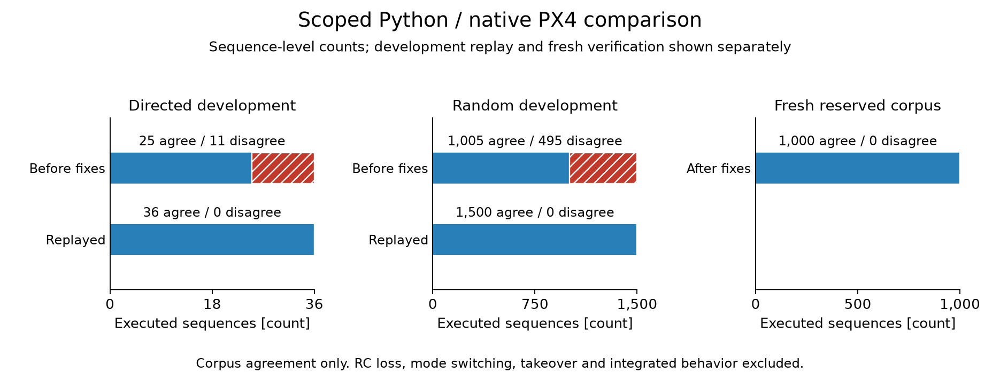

# UAV Failsafe Composition

This repository preserves scoped PX4 failsafe results and unfinished Study A.
The owner has adopted a separate software investigation of control-prototype
deployment under a strong back-to-back testing baseline. Its first numerical
qualification is local sibling staging named `control-code-verification`;
the public repository name remains pending.

Study A is paused pending an explicit release or closure choice. See the
[owner direction](docs/decision-log.md#2026-10-06-adopt-the-control-prototype-deployment-investigation)
and [preserved history](history/README.md).

[](https://github.com/500ft/uav-failsafe-composition/actions/workflows/ci.yml)

[](LICENSE)

[Where it stands](#where-it-stands) · [Roadmap](ROADMAP.md) ·
[Quick start](#quick-start) · [Reviewer guide](docs/START_HERE.md)

## Adopted question

Which defects remain after a costed back-to-back baseline at numerical,
stateful and integration boundaries, and which additional checks reduce them?
The successor separates generation from verification and includes reset, state
and timing wherever the comparison boundary observes them. This repository
contains the prior failsafe evidence indexed below.

## Paused Study A question

A fleet planner can't count on still controlling a drone after its companion
computer or command link fails. The autopilot takes over, and what it does
depends on the firmware version, airframe, full parameter set and the exact
failure. Knowing that it runs PX4 is not enough.

The first study (Study A) asks whether a model extracted from PX4's source
predicts the discrete failsafe response across the required configurations
and event classes on the pinned build. Timing remains descriptive under
[protocol §7b](docs/specs/formal-composition/study-a-protocol.md#7b-amendment-2026-09-30--success-criterion-after-the-decision-sign-off).
Composition claims need the later paired-event gate. The model and native
comparison are infrastructure; agreement with PX4 does not independently
establish mission safety. Recorded simulator runs remain useful if the model
fails its coverage gate.

Prior work already covers generic safety contracts, cross-autopilot wrappers
and reconnection handling. The [source review](docs/day3-source-review.md)
explains how that narrowed the question. The
[current prior-work contrasts](docs/prior-art.md#current-px4-comparison) cover
PX4's own failsafe simulator, SaFUZZ, Nyctea and the autopilot-bug study.

## Where it stands

The simulation setup is PX4 v1.17.0 (commit `d6f12ad`) with its built-in SIH
quadrotor. Public-log firmware revisions and exclusions are reported separately.



The panels use separate count scales. Each unit is a complete sequence;
development replays reuse inputs. [Accessible counts and CSV](results/figures/tables.md#component-comparison)
retain attempted, excluded and invalid denominators. The
[domain packet](evidence/task-domain-2026-10-03/README.md) holds the mechanism
breakdown and counterexamples.

| Evidence boundary | Observed result | Scope and source |
| --- | --- | --- |
| Python model / native class | Agreement after model and adapter repairs | [Declared component domain](evidence/task-domain-2026-10-03/results.json); exercised sequences only |
| SIH datalink runtime | Hold then RTL after the typed parameter transport repair | [Runtime record](evidence/task-runtime-2026-09-29/README.md); harness correction |
| Matched rebuilds | Clean control and fresh instrumented runs completed | [Rebuild](evidence/task-runtime-rebuild-2026-10-03/README.md) and [qualification](evidence/task-observation-qualification-2026-10-04/README.md); earlier failure remains unlocalized |
| Public-log feasibility | Sampled geofence timeline reconstructed; no replay admitted | [Observations and exclusions](evidence/task-public-flight-2026-10-04/README.md); older firmware and incomplete inputs |
| Successor numerical translation | Local development result only | Separate local staging; no qualified integration or public code here |

The [result guide](results/README.md) separates the component counts from the
observed runtime timeline. The [figure guide](docs/data-and-figures.md) gives
reproduction commands and input hashes.

The position-accuracy/POSCTL defect is resolved, with its historical outputs
preserved. Agreement covers only the exercised corpus: datalink loss, geofence
breach and position accuracy in fixed modes, including disarm and rearm. RC
loss, mode switching, pilot takeover and integrated vehicle behavior remain
outside this campaign. There were no invalid or excluded generated sequences;
eight separate unsupported-input probes were rejected before either adapter.
The [domain table](evidence/task-domain-2026-10-03/README.md#domain-recorded-before-execution)
states the parameter and tick limits. This is not universal equivalence.
The source trace identifies heartbeat aging and telemetry publication before
commander's configured timeout. The last received heartbeat is distinct from
both commander's timeout anchor and the runner's cached cut stamp. The
fresh matched builds did not reproduce the tracking failure, and the
instrumented member captured the datalink path on its vehicle clock. This
does not identify the old failure's cause or bound instrumentation overhead.
No new timing tolerance was calibrated; timing remains outside pass/fail, and
Study A confirmation has not run.

The SITL result took a week to get right. Until then every run showed no
failsafe action at all, whatever the hazard. The cause was the test harness:
it sent integer PX4 parameters as ordinary floats, PX4 stores integers as raw
bits in that field, and so the failsafe read a nonsense action setting and chose
"none". The harness now reads each parameter's type from the vehicle and
encodes it the way PX4 expects.

## Quick start

Python 3.11 (the CI version) and Git. The only dependency is pinned in
[requirements.txt](requirements.txt). These checks need no autopilot, GPU or
hardware.

```bash
git clone https://github.com/500ft/uav-failsafe-composition.git
cd uav-failsafe-composition
python3.11 -m venv .venv
source .venv/bin/activate
python -m pip install -r requirements.txt
python scripts/check_repo_contract.py
python scripts/acquisition_ledger.py --check
python -m unittest discover -s tests -v
```

On Windows, activate with `.venv\Scripts\Activate.ps1` instead of `source`.

The contract check and the ledger check should pass and the tests should end
with `OK`. The tests include a regression that replays the recorded output of
PX4's real `Failsafe` class against the model.

To rebuild the literature ledger from committed inputs (offline; unchanged
inputs give no diff):

```bash
python scripts/acquisition_ledger.py
git diff -- evidence/task-day3-2026-09-09/acquisition-ledger.json
```

## What's next

The [dependency roadmap](ROADMAP.md) separates prerequisites from completion
evidence for the local successor and the paused study. Obsolete campaign
enumeration, alternate plans and conceptual figures have been removed; the
[cleanup record](history/README.md#removed-active-material) explains retained
reproduction sources.

The remaining owner decisions are release or closure for the paused study
and the successor's public name. Existing
checks below reproduce retained work; they do not complete Study A.

## Limits

- Results are simulation development work and a small public-log feasibility
  inspection. Public-log exclusions concern observability and the supported
  domain; they are not model-mismatch results. No study result has been generated
  for Study A; confirmation and HITL have not run. No new flights were conducted.
- RC loss can't be injected in this simulator setup, so it is excluded.
- Injection times are lower bounds; the injection latency has not been
  calibrated.
- No safety ranking of autopilots or configurations is claimed. Missing
  physical outcomes limit physical-outcome claims; they do not by themselves
  rule out logical-property studies. Logged state of charge is an estimate,
  not a calibrated reserve for a specified maneuver (see PX4's
  [battery fields](https://docs.px4.io/main/en/msg_docs/BatteryStatus)).
- Flying any of this would need a site risk assessment, containment, an
  independent kill path, a trained safety operator and facility approval.
- Implementation-sensitive contributions follow the
  [disclosure boundary](CONTRIBUTING.md#public-disclosure-boundary).

## Documentation

| Document | What it covers |
| --- | --- |
| [Reviewer guide](docs/START_HERE.md) | The project in five minutes |
| [Roadmap](ROADMAP.md) | Finish line and remaining steps |
| [Study A protocol](docs/specs/formal-composition/study-a-protocol.md) · [decisions](docs/specs/formal-composition/decisions-2026-09-19.md) | What is compared, and the agreement rule |
| [Traceability index](docs/traceability.md) · [number provenance](docs/number-provenance-audit-2026-09-25.md) | Where each number comes from |
| [Source review](docs/day3-source-review.md) · [prior art](docs/prior-art.md) | How prior work shaped the question |
| [Claim ledger](docs/claim-ledger.md) | Each claim and its evidence |
| [Result index](results/README.md) | Scoped results and unfinished confirmation |

## Contributing and license

Reproduction reports, source corrections and protocol critiques are welcome.
Include the commit, the command or source location, and what you expected and
saw. Read [CONTRIBUTING.md](CONTRIBUTING.md) before opening a
[pull request or issue](https://github.com/500ft/uav-failsafe-composition/issues).

Software is [MIT licensed](LICENSE); third-party publications keep their own
licenses. The new public-log observations credit PX4 under
[CC BY 4.0](https://creativecommons.org/licenses/by/4.0/); their
[source record](evidence/task-public-flight-2026-10-04/README.md#reproduce-and-attribution)
keeps raw logs and identifying source URLs outside git. This is a research
repository, not a flight-safety product.
[Repository identity](docs/REPOSITORY_IDENTITY.md).
