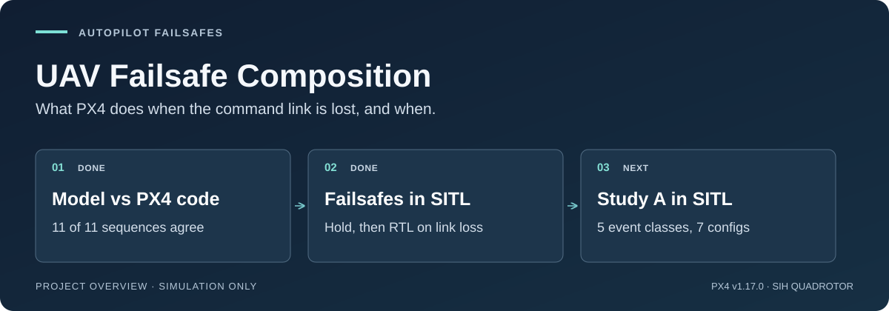

# UAV Failsafe Composition

When a drone loses its command link or companion computer, the autopilot's
failsafe logic decides what happens next. This project builds a model of PX4's
failsafe logic from its source code, checks it against PX4 itself, and
measures in simulation which action PX4 takes after each kind of command loss,
and when.

[](https://github.com/500ft/uav-failsafe-composition/actions/workflows/ci.yml)

[](LICENSE)

[Where it stands](#where-it-stands) · [Roadmap](ROADMAP.md) ·
[Quick start](#quick-start) · [Reviewer guide](docs/START_HERE.md)



*Project overview diagram. It summarises the status below; it is not a result plot.*

## The question

A fleet planner can't count on still controlling a drone after its companion
computer or command link fails. The autopilot takes over, and what it does
depends on the firmware version, airframe, full parameter set and the exact
failure. Knowing that it runs PX4 is not enough.

The first study (Study A) asks a narrower question. For one pinned PX4 build
and configuration, can a model extracted from PX4's source predict which
failsafe action fires, and when? If it can, the model can be used to check
combinations of failures without simulating every one. If it can't, the
recorded simulator runs are still a useful benchmark of what PX4 actually does.

Prior work already covers generic safety contracts, cross-autopilot wrappers
and reconnection handling. The [source review](docs/day3-source-review.md)
explains how that narrowed the question.

## Where it stands

The setup is PX4 v1.17.0 (commit `d6f12ad`) with its built-in SIH quadrotor,
so no external physics simulator is involved.

| Check | Result | Evidence |
| --- | --- | --- |
| Python model against PX4's compiled `Failsafe` class, same input sequences | 11 of 11 agree update for update. The first run agreed on 7 of 9 and exposed an ordering bug in the model, which was fixed | [Differential](evidence/task-differential-2026-09-29/README.md) |
| SITL datalink loss in Auto Loiter | Hold, then RTL, also on the unmodified PX4 binary | [Runtime record](evidence/task-runtime-2026-09-29/README.md) |
| Time from link loss to RTL | 16.4 s and 16.7 s. The timers account for 15 s (10 s detection plus 5 s hold); the extra time is not explained yet | [results.json](evidence/task-runtime-2026-09-29/results.json) |

The SITL result took a week to get right. Until then every run showed no
failsafe action at all, whatever the hazard. The cause was the test harness:
it sent integer PX4 parameters as ordinary floats, PX4 stores integers as raw
bits in that field, and so the failsafe read a nonsense action setting and chose
"none". The harness now reads each parameter's type from the vehicle and
encodes it the way PX4 expects.

## Quick start

Python 3.11 (the CI version) and Git. The only dependency is pinned in
[requirements.txt](requirements.txt). These checks need no autopilot, GPU or
hardware.

```bash
git clone https://github.com/500ft/uav-failsafe-composition.git
cd uav-failsafe-composition
python3.11 -m venv .venv
source .venv/bin/activate
python -m pip install -r requirements.txt
python scripts/check_repo_contract.py
python scripts/acquisition_ledger.py --check
python -m unittest discover -s tests -v
```

On Windows, activate with `.venv\Scripts\Activate.ps1` instead of `source`.

The contract check and the ledger check should pass and the tests should end
with `OK`. The tests include a regression that replays the recorded output of
PX4's real `Failsafe` class against the model.

To rebuild the literature ledger from committed inputs (offline; unchanged
inputs give no diff):

```bash
python scripts/acquisition_ledger.py
git diff -- evidence/task-day3-2026-09-09/acquisition-ledger.json
```

## What's next

Run Study A: 60 single-event SITL cases, each compared with the model, judged
by a rule fixed in advance. Three or fewer disagreements and the model is kept;
seven or more and the benchmark is released without it. The
[roadmap](ROADMAP.md) lists the steps, starting with signing off the study
decisions the work already uses.

## Limits

- Everything so far is development work in simulation.
  No study result has been generated yet; the confirmation campaign has not run,
  and no HITL or flight data exists.
- RC loss can't be injected in this simulator setup, so it is excluded.
- Injection times are lower bounds; the injection latency has not been
  calibrated.
- No safety ranking of autopilots or configurations is claimed.
- Flying any of this would need a site risk assessment, containment, an
  independent kill path, a trained safety operator and facility approval.
- Implementation-sensitive contributions follow the
  [disclosure boundary](CONTRIBUTING.md#public-disclosure-boundary).

## Documentation

| Document | What it covers |
| --- | --- |
| [Reviewer guide](docs/START_HERE.md) | The project in five minutes |
| [Roadmap](ROADMAP.md) | Finish line and remaining steps |
| [Study A protocol](docs/specs/formal-composition/study-a-protocol.md) · [decisions](docs/specs/formal-composition/decisions-2026-09-19.md) | What is compared, and the agreement rule |
| [Traceability index](docs/traceability.md) · [number provenance](docs/number-provenance-audit-2026-09-25.md) | Where each number comes from |
| [Source review](docs/day3-source-review.md) · [prior art](docs/prior-art.md) | How prior work shaped the question |
| [Claim ledger](docs/claim-ledger.md) | Each claim and its evidence |
| [Results notice](results/README.md) | Why the results folder is empty |

## Contributing and license

Reproduction reports, source corrections and protocol critiques are welcome.
Include the commit, the command or source location, and what you expected and
saw. Read [CONTRIBUTING.md](CONTRIBUTING.md) before opening a
[pull request or issue](https://github.com/500ft/uav-failsafe-composition/issues).

Software is [MIT licensed](LICENSE); third-party publications keep their own
licenses. This is a research repository, not a flight-safety product.
[Repository identity](docs/REPOSITORY_IDENTITY.md).
