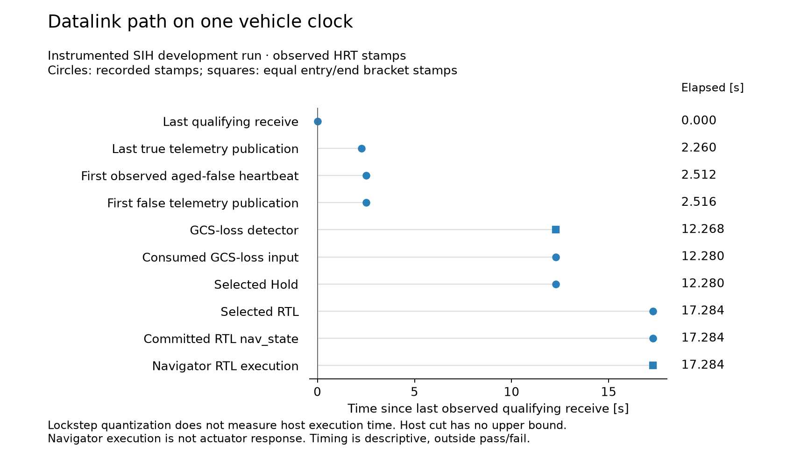

# Results

No study result is available for Study A. Confirmation is incomplete and paused under the
[owner direction](../docs/decision-log.md#2026-10-06-adopt-the-control-prototype-deployment-investigation).
The repository does contain executed component and development results.

| Evidence | Source and reproduction |
| --- | --- |
| Native PX4 unit tests | [Component packet](../evidence/task-oracle-2026-09-26/README.md) |
| Repaired model against the native class, within the declared domain | [Domain and commands](../evidence/task-domain-2026-10-03/README.md), [results](../evidence/task-domain-2026-10-03/results.json) |
| Typed parameter repair and datalink Hold then RTL | [Runtime packet](../evidence/task-runtime-2026-09-29/README.md) |
| Fresh matched builds and datalink observation | [Qualification and commands](../evidence/task-observation-qualification-2026-10-04/README.md), [results](../evidence/task-observation-qualification-2026-10-04/results.json) |
| Sampled public geofence timeline; no admitted replay | [Public-log packet](../evidence/task-public-flight-2026-10-04/README.md), [results](../evidence/task-public-flight-2026-10-04/results.json) |

## Component comparison

Each panel has its own count axis. Development replay uses the same inputs;
fresh verification is a separate corpus, not Study A confirmation.
[Accessible table and CSV](figures/tables.md#component-comparison) include
all attempted, invalid and excluded counts, plus separate admission probes.
[SVG](figures/component-agreement.svg).

## Observed datalink path

This single instrumented development run uses one vehicle HRT clock. The host
cut remains open above and is omitted from the axis. Squares show equal
entry/end bracket stamps under SIH lockstep; they do not measure host execution
time. Navigator execution is not a physical response measurement. Timing stays
outside pass/fail. The clean control has no internal observation markers, so
this is not an overhead comparison.
[Accessible stages and exact microsecond CSV](figures/tables.md#instrumented-datalink-observations) ·
[SVG](figures/datalink-observations.svg) ·
[Cadence, gaps, typed parameters and binary identity](../evidence/task-observation-qualification-2026-10-04/results.json).

## Reproduction and limits

Each packet states its pin, inputs, exclusions, source hashes and raw-archive
location. The [README checks](../README.md#quick-start) exercise retained code.
Component agreement and development observations do not complete the
[Study A coverage gate](../docs/specs/formal-composition/study-a-protocol.md).
The software successor's numerical result and hosted reproduction are published
in [control-code-verification](https://github.com/500ft/control-code-verification).
They qualify development numerical agreement; integration remains unqualified.

The development runs are never held-out confirmation and never a measured
physical-flight result.
